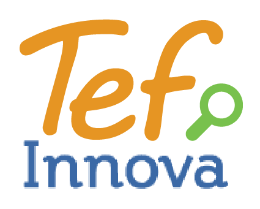
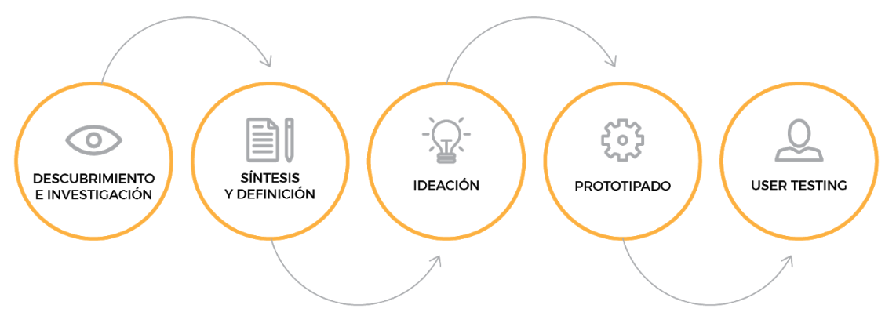
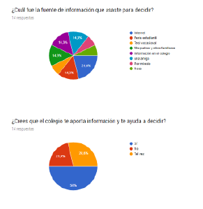
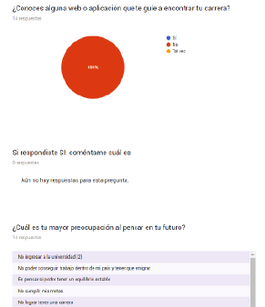
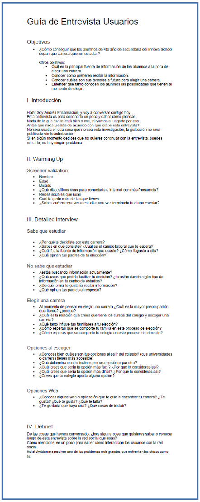
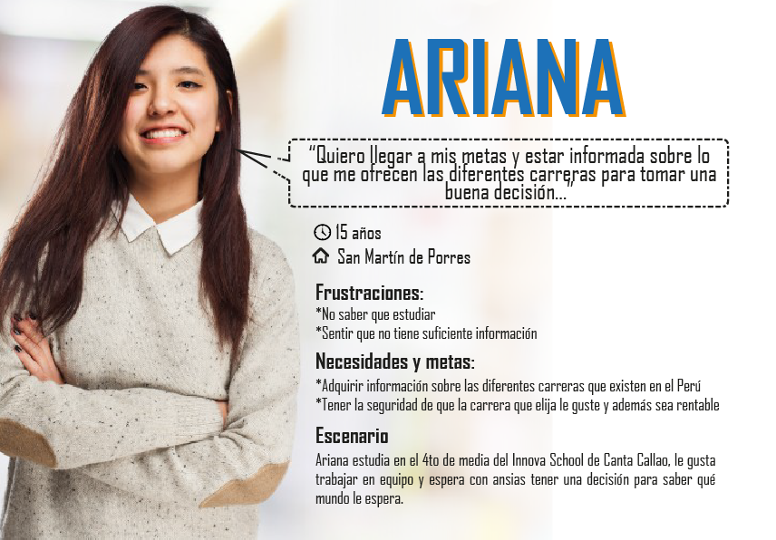
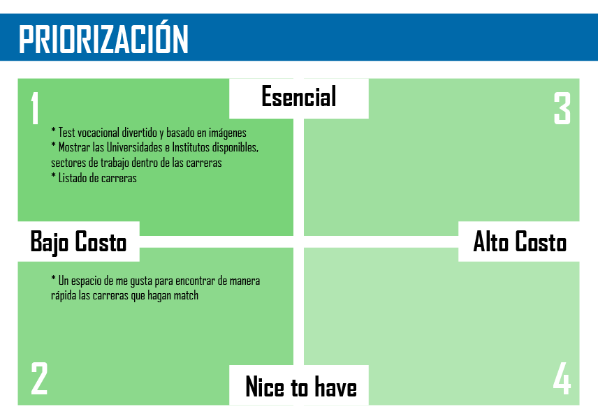

   

# INFORMACIÓN DE NEGOCIO

## Acerca de Innova School

### Historia

En 1994, Carlos Rodríguez Pastor regresó a su Perú natal, de donde había partido siendo un niño. Después de estudiar en la Universidad de California en Berkeley, pasó unos años trabajando en Wall Street, donde estableció un fondo de coberturas.
Tras su regreso a Perú, se enfocó en trabajar junto a su padre para convertir al banco Interbank en uno de los mayores grupos económicos del país. Hoy, a través del holding InterGroup, Rodríguez Pastor controla un imperio, que incluye la desarrolladora Urbi Propiedades, la cadena hotelera Casa Andina, la aseguradora Interseguro, además de Supermercados Peruanos, los centros comerciales Real Plaza y las farmacias InkaFarma, entre otros.
Pero algo faltaba. Perú había tratado bien al empresario, que veía con pesar los graves problemas sociales en su país y quería devolverle la mano. Por ello, en 2011, contrató a la firma de diseño IDEO, y juntos crearon un nuevo modelo educacional para niños de ingresos medio que hasta entonces no tenían una alternativa a los costosos colegios privados del país.
Debido a las deficiencias del sistema público, hoy existen más de 21 mil instituciones particulares en Perú, donde estudian casi la mitad de los niños en Lima y un cuarto de los 8 millones de niños a nivel nacional.
El resultado fueron los colegios Innova, que con una mensualidad de solo US$ 130 (cerca de 85 mil pesos chilenos) atiende a alumnos en algunas de las regiones más pobres del país y que está revolucionando el sistema peruano de educación. A sólo dos años de su inicio, el 61% de los alumnos de educación superior de Innova registraba puntajes destacados en los exámenes nacionales de matemáticas, frente a un promedio país de 17%.
Ahora es la red privada más grande de Perú, con 41 establecimientos que atienden a cerca de 31.000 alumnos, pero para el próximo año pretende expandirse a 50 locaciones y 40.000 estudiantes.
Colegios abiertos. El modelo de Innova ha sido destacado a nivel internacional por el programa global de premios de diseño International Design Excellence Awards (IDEA).
Cada uno de los establecimientos está dividido en dos secciones. Los niños pasan la mitad del tiempo en clases pequeñas de 30 alumnos enfocadas en la resolución de problemas y la colaboración, con una intervención mínima de los profesores. La otra mitad está destinada a aprendizaje independiente, utilizando sitios especializados. La iniciativa se basa en un sistema de aprendizaje mixto, que utiliza la tecnología y el estudio independiente-guiado para fomentar el pensamiento creativo, flexible y crítico.

### Metodología

Blended Learning es un programa educativo (formal o no formal) que combina medios digitales en línea con métodos tradicionales en el aula. Requiere la presencia física del maestro y del alumno, con algún elemento de control del alumno sobre el tiempo, el lugar, la ruta o el ritmo. Mientras los estudiantes siguen asistiendo a escuelas "tradicionales" con un maestro presente, las prácticas presenciales en el aula se combinan con actividades mediadas por computadora con respecto al contenido y la entrega. El aprendizaje combinado también se utiliza en entornos de desarrollo profesional y capacitación. 

#### Ventajas

Blended Learning es un programa educativo (formal o no formal) que combina medios digitales en línea con métodos tradicionales en el aula. Requiere la presencia física del maestro y del alumno, con algún elemento de control del alumno sobre el tiempo, el lugar, la ruta o el ritmo. Mientras los estudiantes siguen asistiendo a escuelas "tradicionales" con un maestro presente, las prácticas presenciales en el aula se combinan con actividades mediadas por computadora con respecto al contenido y la entrega. El aprendizaje combinado también se utiliza en entornos de desarrollo profesional y capacitación. 

### Perfil del egresado

* [Graduados Innova School](https://www.innovaschools.edu.pe/blog/felicitaciones-a-nuestros-graduados/)

* [Graduados Innova School](https://www.youtube.com/watch?v=S9xBBYaqV3I)

* [Graduados Innova School](https://www.facebook.com/innovaschools/videos/1432658623469723/)

   

# DESCUBRIMIENTO E INVESTIGACIÓN

## Research

### Comportamientos estándares de jóvenes

**14 años**

A los catorce años un adolescente comienza a ser dueño de sí: feliz y seguro de sí mismo, exuberante y enérgico y de una firme fibra emocional, dispuesto siempre a satisfacer las exigencias del mundo exterior.
Lo lógico sería suponer que estas excelentes y promisorias cualidades han de intensificarse y hacerse más amplias en el curso del año siguiente. Pero las cosas no suceden de este modo, porque el desarrollo, como ya se dijo, obedece a una lógica distinta.
En esta edad se suelen establecer los comportamientos más específicos de la adolescencia, donde el joven:
• Lucha con su sentido de identidad,
• Se siente extraño o abochornado consigo mismo o con su cuerpo,
• Se enfoca en sí mismo, alternando entre altas expectativas y un pobre concepto propio,
• Lo influencian los amigos en su modo de vestir e intereses,
• Su humor es cambiante,
• Mejora su habilidad del uso del lenguaje y su forma de expresarse,
• Tiene menos demostraciones de afecto hacia los padres; ocasionalmente se pone grosero,
• Se queja de que los padres interfieren con su independencia, y
• Tiene la tendencia a regresar al comportamiento infantil, particularmente cuando está bajo mucho estrés.

**15 años**

Frecuentemente, el adolescente de quince años es ‘indiferente’ y habla con voz suave, en lugar del exuberante vozarrón del año anterior. Sus energías de expansión son tan magras que a veces se lo cree perezoso o, por lo menos, cansado. Produce cierta impresión de apatía. Esta impresión, sin embargo, puede ser muy bien errónea, pues la aparente apatía se halla estrechamente relacionada con una reposada y reflexiva preocupación por sus estados anímicos íntimos.
Concede una atención focalizada a estos sutiles estados, que constrastan con las emociones más vigorosas de un año antes. Algunos de los rasgos de madurez más significativos se refieren, a esta edad, a un marcado refinamiento de los patrones anímicos.
Esta creciente apreciación de los matices y formas sutiles del sentimiento se ponen de manifiesto en una nueva sensibilidad e irritabilidad, junto con multitud de resistencias, aversiones y sospechas que pueblan su conducta.
Lo sentimientos, ya sean positivos o negativos, no nos vienen plenamente formados desde nuestro origen. Se van configurando poco a poco a través del crecimiento y la experiencia.

**16 años**

La gran espiral del desarrollo humano tiene sus subciclos mayores y menores. El mayor, iniciado a los diez años, alcanza su culminación a los dieciséis, para luego desenvolverse durante cinco años más hacia el nivel de la madurez total. El adolescente de dieciséis años no tiene más que pararse en puntas de pie, prácticamente, para ver el horizonte de la edad adulta. El mismo es algo así como un preadulto.
La propia sociedad le acuerda sus reconocimientos a esta creciente madurez a través de diversas normas, costumbres y leyes. La actitud de los padres, profesores y preceptores sufre modificaciones sutiles cuando éstos advierten la creciente madurez del joven. El intercambio se desarrolla prácticamente en un pie de igualdad. El adolescente de dieciséis años tiene una mente más dueña de sí misma, porque se halla mejor ordenada y controlada.
Los quince años eran una etapa necesaria. En ella se preparó el camino para las integraciones más vastas y mejor equilibradas de la conducta del joven de dieciséis. Con esta ventaja, ahora despliega una mayor confianza en sí mismo y una autonomía más profunda. La entera fe en sí mismo es el rasgo más característico de esta edad, y el síntoma de sus aptitudes latentes.
Es más tolerante con todo el mundo en general. Tiende a aceptar la vida tal como la encuentra. En caso de llegar una visita inesperada, puede sorprender a su familia por la cordialidad desplegada y la desenvoltura casi adulta con que la recibe.

**Adolecentes en general**

Cambios emocionales y sociales
Se interesan más por las relaciones románticas y la sexualidad.
Tienen menos conflictos con los padres.
Muestran más independencia de los padres.
Tienen una mayor capacidad para mostrar afecto y compartir, y de desarrollar relaciones más íntimas.
Pasan menos tiempo con sus padres y más con los amigos.
La tristeza o la depresión pueden afectar su rendimiento escolar y hacer que consuman alcohol y drogas, tengan relaciones sexuales sin protección y enfrenten otros problemas.
Razonamiento y aprendizaje
Aprenden hábitos de trabajo más definidos.
Se muestran más preocupados por sus estudios, planes de estudio y trabajo futuros.
Son más capaces de justificar sus decisiones, como la distinción entre lo correcto y lo incorrecto.

**Fuentes**

<https://yoaprendo.wordpress.com/2007/05/17/adolescentes-14-15-y-16-anos/_>

<https://www.cdc.gov/ncbddd/spanish/childdevelopment/positiveparenting/adolescence2.html>

## Google Formulario
   
  

## Entrevistas a Usuarios
   

# SÍNTESIS Y DEFINICIÓN

## Afinity mapping

## User persona 

## Problem 

* Ariana necesita obtener información de cada carrera para hacer una buena elección
* Ariana necesita escoger una carrera que le guste y sea rentable para no temer de su futuro
* Ariana necesita una forma de saber que Universidades cuentan con la carrera que le interesa para elegir la opción más correcta.
* Ariana necesita saber cuáles son los beneficios que le ofrece cada carrera para comparar las que más le interesan.
* Ariana necesita conocer los precios de las universidades e institutos para tener en cuenta su presupuesto.

## HMW

* HMW para que la información sea clara y precisa.
* HMW para que los gustos ayuden a la elección y muestra de información
* HMW reflejar la rentabilidad de las carreras
* HMW listar las universidades por carreras
* HMW mostrar los beneficios que cada carrera ofrece
* HMW mostrar los precios de las universidades

## What if

* What if no necesitaran la información?
* What if alguien ayuda a los jóvenes a saber que quieren estudiar?
* What if si todas las carreras son rentables?
* What if solo habría una universidad?
* What if los beneficios fueran como calificaciones?
* What if todas las carreras costaran igual?

# IDEACIÓN

## Benchmarck

## Feature list

* Test vocacional divertido y basado en imágenes
* Un espacio de me gusta para encontrar de manera rápida las carreras que hagan match
* Mostrar las Universidades e Institutos disponibles, sectores de trabajo dentro de las carreras
* Una opción para mostrar el precio de las instituciones y el proceso de admisión dentro de las carreras
* Listado de carreras
* Listado de Universidades e Institutos
 
## Priorizacion

## Mvp

# PROTOTIPADO

## Content Prototype
## Paper prototyping
## Prototipo de alta fidelidad
## Prototipo interactivo

# TESTING

